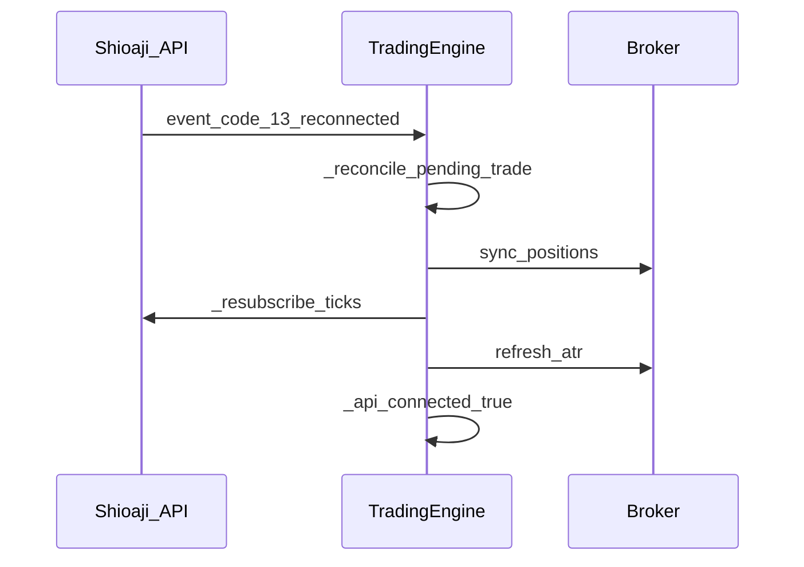

# Live Trading Safety & Failure Modes

This document describes what the kernel does when things go wrong during live operation. It complements [DESIGN.md](DESIGN.md) (invariants) and [README.md](../README.md) (go-live checklist).

**Scope reminder:** single-direction, full-lot position model for ~1-lot TAIFEX day-session strategies — not general portfolio management.

## How to read this table

| Column | Meaning |
|--------|---------|
| **Scenario** | Real-world failure or edge case |
| **Kernel behavior** | What `TradingEngine` actually does |
| **Expected outcome** | Position / pending / risk state after the event |
| **Operator action** | What you should do in your consuming app |

---

## Failure scenarios

### Session-end disconnect with open position (e.g. 13:43)

| | |
|---|---|
| **Kernel behavior** | At `session_force_flatten_time`, kernel calls `_maybe_kernel_force_flatten` inside `on_tick` lock. If `position_qty > 0` and not already pending exit, it arms a full exit `OrderSignal`. Session watchdog may also trigger relogin on disconnect. |
| **Expected outcome** | If ticks still arrive: forced exit is armed. If disconnected with no ticks: force-flatten cannot fire until reconnect + tick; position may remain open past flatten time. |
| **Operator action** | Ensure `AlertPort` fires on disconnect near session end. Manually flatten via broker UI if kernel cannot tick. Test reconnect + `sync_positions` before go-live. |

**Code:** `engine.py:on_tick`, `order_executor.py:_maybe_kernel_force_flatten`, `engine.py:_check_session_watchdog`

---

### Pending timeout + reconcile failure

| | |
|---|---|
| **Kernel behavior** | `_check_pending_timeout` calls `_reconcile_pending_trade` (via `update_status` + `order_deal_records`). If unresolved after `pending_timeout_sec`, clears pending, sends **CRITICAL** alert, runs `sync_positions`, sets `block_new_entry = True`. |
| **Expected outcome** | Pending cleared; actual broker position may differ from kernel belief until sync succeeds. New entries blocked until next trading-day reset (or manual intervention). |
| **Operator action** | Inspect broker positions immediately. Do not assume flat. Review `FILL_AUDIT` / order logs. Clear `block_new_entry` only after manual reconciliation (restart or custom app logic). |

**Code:** `order_executor.py:_check_pending_timeout`, `_reconcile_pending_trade`

---

### CA / certificate activation failure

| | |
|---|---|
| **Kernel behavior** | `login()` in live mode requires `SJ_CA_PATH` and `SJ_CA_PASSWD`. `_activate_ca` tries without `person_id`, then with `SJ_CA_PERSON_ID` or account `person_id`. Failure raises `RuntimeError` — login aborts. |
| **Expected outcome** | Engine never reaches `run()` loop; no orders placed. |
| **Operator action** | Verify CA file path, password, and `SJ_CA_PERSON_ID`. Test in simulation first. Never commit cert files (see `.env.example`). |

**Code:** `session.py:login`, `_activate_ca`

---

### Repeated re-login exhaustion

| | |
|---|---|
| **Kernel behavior** | `_check_session_watchdog` retries `api.login` with exponential backoff. After `session_relogin_max_attempts`, sends **CRITICAL** alert and pauses retries for 300s. |
| **Expected outcome** | API may stay disconnected; no new ticks; pending state frozen; open positions unmanaged by kernel until reconnect. |
| **Operator action** | Implement `AlertPort` with paging/Telegram. Monitor broker dashboard. Consider manual flatten if disconnect persists through session end. |

**Code:** `engine.py:_check_session_watchdog`, `handle_session_event`

---

### No-tick watchdog → resubscribe failure

| | |
|---|---|
| **Kernel behavior** | During trading session, if no tick for `no_tick_timeout_sec`, logs warning and calls `_resubscribe_ticks` hook (set by `ShioajiLiveBootstrap`). Throttled to once per 60s. Failure logs warning only. |
| **Expected outcome** | Strategy evaluation stops (no ticks); existing position unchanged; pending orders may timeout separately. |
| **Operator action** | Confirm `ShioajiLiveBootstrap.attach()` wired resubscribe hook. Check API usage limits and contract subscription. |

**Code:** `engine.py:_check_no_tick_watchdog`, `adapters/shioaji_live.py`

---

### ATR / trend refresh persistent failure

| | |
|---|---|
| **Kernel behavior** | `refresh_atr` runs in a daemon thread. Failure logs `ATR 更新失敗` warning; **last known** `current_atr` / `trend_dir` retained. No automatic `block_new_entry`. |
| **Expected outcome** | Strategy may use stale ATR/trend; vol thresholds and trailing logic may be wrong. |
| **Operator action** | Monitor ATR log lines. Strategy should treat stale indicators conservatively (future: kernel may expose `_atr_stale` flag). |

**Code:** `engine.py:refresh_atr`, `_maybe_refresh_atr`

---

### Multiple open positions on same contract (mixed directions)

| | |
|---|---|
| **Kernel behavior** | `sync_positions` takes **first** matching non-zero position for the contract. Does not net multiple legs. Unmatched positions log warning only. |
| **Expected outcome** | Kernel state may not reflect full broker exposure. |
| **Operator action** | Avoid manual trades outside kernel on the same contract. Flatten manually before restart if state is ambiguous. |

**Code:** `session.py:sync_positions`

---

### Reconnect: `trailing_peak` calibration delayed

| | |
|---|---|
| **Kernel behavior** | After `sync_positions` with `force_resync`, sets `_resynced_position = True` and `trailing_peak = entry_price`. First post-resync tick calls `_calibrate_trailing_peak_after_resync`. |
| **Expected outcome** | Trailing stop may be conservative until first tick; one-tick window of suboptimal peak. |
| **Operator action** | Expect slightly wider trailing right after reconnect. Avoid restarting during fast markets if trailing is critical. |

**Code:** `session.py:sync_positions`, `engine.py:on_tick`, `order_executor.py:_update_trailing_peak`

---

### Invalid strategy `OrderSignal` (qty ≤ 0, bad intent, etc.)

| | |
|---|---|
| **Kernel behavior** | `_validate_order_signal` rejects before `_arm_pending`; logs warning; signal discarded for that tick. |
| **Expected outcome** | No order armed; state unchanged. |
| **Operator action** | Fix strategy plugin. Add unit tests for signal shape. See [STRATEGY.md](STRATEGY.md). |

**Code:** `order_executor.py:_validate_order_signal`, `engine.py:on_tick`

---

### Direct mutation of engine state (telemetry / strategy bug)

| | |
|---|---|
| **Kernel behavior** | No protection — Python attributes are public. External writes can break invariants (double entry, wrong qty, stuck pending). |
| **Expected outcome** | Undefined behavior; tests will not cover your mutation path. |
| **Operator action** | **Never** assign to `engine.position_qty`, `engine.is_pending`, etc. Use `get_state_snapshot()` for read-only observation only. |

**Code:** `engine.py:get_state_snapshot`, [DESIGN.md](DESIGN.md)

---

## Reconnect sequence (reference)



---

## Telemetry: safe snapshot + CRITICAL alert

觀察狀態請用 snapshot，勿讀寫 engine 屬性；嚴重事件透過 `AlertPort` 往外送：

```python
def on_tick_observed(engine, alerts):
    snap = engine.get_state_snapshot()
    if not snap.api_connected and snap.has_position:
        alerts.send(
            f"斷線持倉中 qty={snap.position_qty} dir={snap.position_dir}",
            level="CRITICAL",
        )
    if snap.is_pending:
        # 僅觀察；勿 engine.is_pending = False
        pass
```

Kernel 內建路徑（pending 超時、重登入耗盡等）已會呼叫 `AlertPort.send(..., level="CRITICAL")` — 你的實作需確保這些訊息能送達（Telegram、PagerDuty 等）。

---

## Related documents

- [README.md § Go-Live Checklist](../README.md)
- [DESIGN.md](DESIGN.md) — kernel invariants
- [STRATEGY.md](STRATEGY.md) — strategy author rules